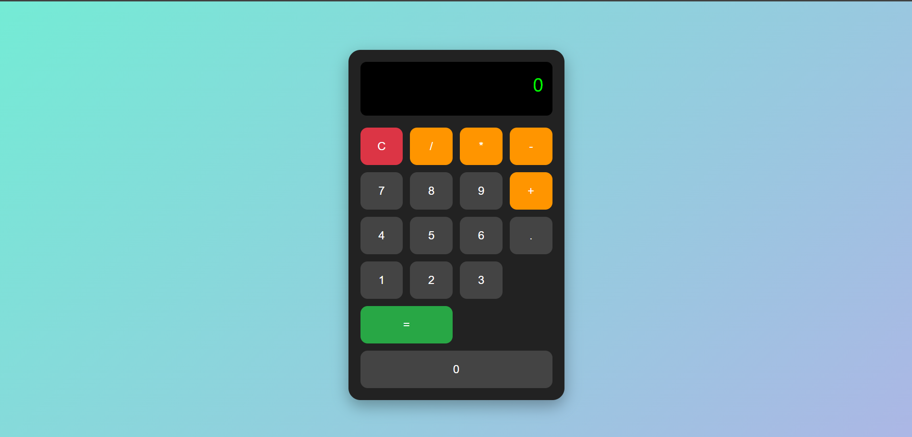

# 📟 Basit Hesap Makinesi

HTML, CSS ve JavaScript kullanılarak yapılmış basit ve şık bir **hesap makinesi** projesi.  
Bu proje, dört işlem yapabilen basit bir web tabanlı uygulamadır.

## 🚀 Özellikler
- Toplama, çıkarma, çarpma ve bölme işlemleri
- Temizle (C) butonu
- Responsive ve modern tasarım
- Hover animasyonları ve gölge efektleri

## 🛠️ Kullanılan Teknolojiler
- HTML5
- CSS3
- JavaScript (Vanilla)

## 📷 Önizleme


## 📂 Proje Yapısı
calculator-project
┣ 📄 index.html
┣ 📄 style.css
┣ 📄 script.js
┗ 📄 README.md


## 💻 Kullanım
1. Bu projeyi klonla:
   ```bash
   git clone https://github.com/kullaniciadi/calculator-project.git

2. Klasöre gir:
    cd calculator-project

3. index.html dosyasını tarayıcıda aç
